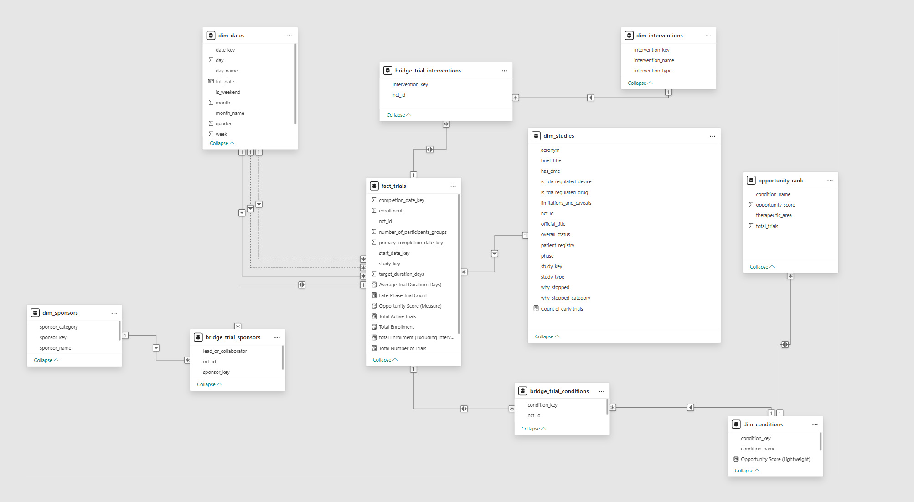

# Clinical Trial White Space & Opportunity Analysis

## Video Demonstration
  
*5-minute walkthrough of the SQL pipeline and Power BI dashboard.*

---

## The Strategic Challenge: The Problem
In the high-stakes world of pharmaceutical R&D, leaders are tasked with allocating multi-million dollar budgets across a fiercely competitive landscape. Making the right investment decision is critical. The core challenge is to systematically identify promising, under-funded research areas ("white space") while simultaneously recognizing and avoiding therapeutic areas that are already saturated with late-stage competition.

Relying on intuition or high-level trial counts is no longer sufficient; a data-driven, quantitative approach is needed to navigate this complexity and invest with confidence.

---

## The End-to-End Solution: The Data Pipeline & Dashboard
To address this challenge, I engineered a complete end-to-end data analytics solution. The project transforms raw, complex clinical trial data from the AACT database into a powerful strategic decision-making tool for R&D leadership.

The solution is built on two core components:

### 1. A Reproducible SQL Data Pipeline
Using a Bronze ➡ Silver ➡ Gold architecture, the pipeline systematically ingests, cleans, and standardizes the raw data. The Gold layer culminates in a sophisticated weighted scoring model that ranks therapeutic conditions based on four key strategic vectors:
- **Research Momentum:** How active is the early-stage research?
- **Competitive Density:** How many industry players are already in the space?
- **Market Saturation:** How crowded is the late-stage (Phase 3 & 4) pipeline?
- **Business Relevance:** Does the research focus on core therapeutic modalities (drugs and biologics)?

### 2. An Interactive Power BI Dashboard
The final, aggregated data feeds a dynamic dashboard designed for an executive audience. It provides a clear, quantitative framework to support high-stakes 'Go/No-Go' portfolio decisions, moving beyond raw data to deliver actionable strategic intelligence.

---

## The Impact: Data-Driven Strategic Intelligence
This solution directly translates a massive, noisy dataset into a clear competitive advantage. The final dashboard empowers the Head of R&D to:
- **Instantly Identify Opportunity:** The weighted scoring model automatically surfaces high-potential therapeutic niches that balance scientific momentum with a favorable competitive landscape.
- **De-Risk Investment Decisions:** By quantifying market saturation and competitive density, the framework provides a data-driven rationale for avoiding oversaturated areas and focusing resources where they can have the greatest impact.
- **Drive Strategic Conversations:** The dashboard serves as a single source of truth, enabling leadership to explore the data, drill down into specific conditions, and make portfolio decisions grounded in a robust, quantitative methodology.

For example, the model successfully pinpointed high-potential oncology niches like cervical cancers and advanced NSCLC, alongside significant opportunities in major markets like obesity and atrial fibrillation, providing clear signals for deeper investigation.

---

## Technical Deep Dive

### Data Pipeline Architecture: Bronze ➡ Silver ➡ Gold
The project's foundation is a robust, multi-layered data pipeline built in SQL. This architecture ensures data quality, traceability, and scalability.

#### Bronze Layer (Raw Ingestion)
Raw data files (e.g., `studies.txt`, `sponsors.txt`) are loaded into the database without any transformation. This layer serves as the "single source of truth" and allows for complete reproducibility.

#### Silver Layer (Cleansing & Conformance)
This is where the majority of the data transformation happens. SQL scripts are used to:
- **Clean & Standardize:** Inconsistent sponsor names (e.g., 'Pfizer Inc.' vs. 'Pfizer') are standardized, and messy categorical data (like trial phases) are conformed to a master list.
- **Enrich Data:** New, valuable columns are engineered, such as `why_stopped_category` (which categorizes free-text stoppage reasons) and `therapeutic_area` (derived from condition names).
- **Handle Nulls & Outliers:** Missing values are intelligently imputed, and outliers (e.g., in enrollment numbers) are capped to prevent skewing the analysis.

#### Gold Layer (Reporting & Aggregation)
The final layer prepares the data for Power BI. It consists of clean, aggregated tables structured in a star schema. This layer includes the `opportunity_rank` table, which contains the pre-calculated opportunity score for each condition, ensuring fast and efficient dashboard performance.

---

## Data Model: A Star Schema for Strategic Analysis

  
*Optimized for analytical performance and clean querying.*

### Fact Table
- **`fact_trials`:** The heart of the model. It contains the numeric, measurable data for each trial, such as enrollment and `target_duration_days`, as well as foreign keys to the dimension tables.

### Dimension Tables
- **`dim_studies`:** Contains all the descriptive, textual attributes of a trial (title, status, phase, etc.).
- **`dim_sponsors`:** A clean, master list of all trial sponsors and their categories (Industry, Academia, etc.).
- **`dim_conditions`:** A standardized list of all medical conditions studied.
- **`dim_interventions`:** A clean list of all interventions (e.g., specific drugs, placebos).
- **`dim_dates`:** A comprehensive date table for robust time-series analysis (YoY growth, etc.).

### Bridge Tables (Resolving Many-to-Many Relationships)
A single trial can study multiple conditions and have multiple sponsors. To model these many-to-many relationships correctly without ambiguity, bridge tables are used:
- `bridge_trial_conditions`: Links trials to conditions.
- `bridge_trial_sponsors`: Links trials to sponsors.
- `bridge_trial_interventions`: Links trials to interventions.

### Specialized Business Table
- **`opportunity_rank`:** A pre-computed table that holds the final weighted opportunity score for each condition. This table directly powers the "white space" analysis in the dashboard, ensuring insights are delivered instantly without complex runtime calculations.

---

## Key Insights & Strategic Recommendations
The final, weighted Opportunity Score model successfully filtered over 218,000 interventional trials to generate a prioritized list of investment opportunities. The analysis produced several actionable insights for strategic R&D planning:

### 1. Prioritize High-Value Oncology Niches
**Insight:** The model consistently ranked specific oncology indications as top-tier opportunities, including solid tumor cancer, advanced NSCLC, and cervical cancers. These areas are characterized by high research momentum but a competitive landscape that is not yet fully saturated with late-stage products.  
**Strategic Recommendation:** Conduct a deeper competitive analysis into the specific molecular targets and emerging biotechs active in these high-scoring cancer types to identify precise entry points.

### 2. Target Next-Generation Therapies in Major Markets
**Insight:** Beyond oncology, the model identified major markets like obesity/overweight (Metabolic) and atrial fibrillation (Cardiovascular) as significant opportunities. While competitive, the model's high score indicates that the current standard of care is not a complete solution, leaving a clear "white space" for a "best-in-class" or novel therapy.  
**Strategic Recommendation:** Use this signal to investigate next-generation opportunities, such as therapies with novel mechanisms of action for obesity or advanced treatments for specific atrial fibrillation patient populations.

### 3. Investigate Underserved Patient Populations in Mature Markets
**Insight:** The analysis also flagged opportunities in established therapeutic areas like ulcerative colitis (Inflammatory & Autoimmune). The data signature for these opportunities—a mix of mature, late-stage products alongside persistent early-stage research—points to a significant unmet need among patients who are refractory to current treatments.  
**Strategic Recommendation:** This represents a validated market where a novel biologic targeting this underserved segment could achieve significant success.

---

## Conclusion
Ultimately, this project demonstrates a robust, data-driven methodology for moving beyond simple trial counts to a sophisticated strategic analysis, enabling R&D leadership to de-risk investment decisions and focus resources on areas with the highest potential for patient impact and commercial return.
# Clinical Trials 
